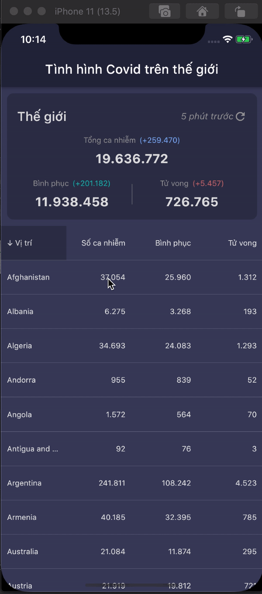

# Tham gia Flutter UI Challenge #1
Tham gia Flutter UI Challenge #1. 100 giải cho 100 bạn nộp bài đạt các tiêu chí chấm giải, chất lượng tốt, và 3 giải đặc biệt cho 3 bạn xuất sắc nhất.

## Đề tài:
Thiết kế một screen/page (web hoặc mobile) tổng kết số ca mắc Covid-19 trên toàn thế giới.

## Yêu cầu:
- Thiết kế trên 1 screen/page
- Dữ liệu có thể động hoặc tĩnh
- Sử dụng công nghệ Flutter
- Ứng dụng mobile hoặc web
- Tương thích hiển thị cho Pixel 2 (Android) và Iphone 11 (IOS), hoặc Chrome (nếu là Web app)

## Tiêu chí đạt giải:
- UI/UX thân thiện với người xem
- Hiển thị đầy đủ các thông tin trên 1 screen
- Hàm lượng kỹ thuật nhiều
- Sử dụng Flare/Rive là một điểm cộng
- Thông tin động là một điểm cộng

## Giải đặc biệt số 1: Cặp Google Developers cho Best UI/UX

## Cách thức nạp bài:
- Gửi về form đăng kí của BTC link git của project trong khung thời gian từ 25/7 đến 8/8
- Trong Git bao gồm: Project + Video record lại màn hình ứng dụng.
- Giải thưởng công bố dự kiến ngày 22/8

